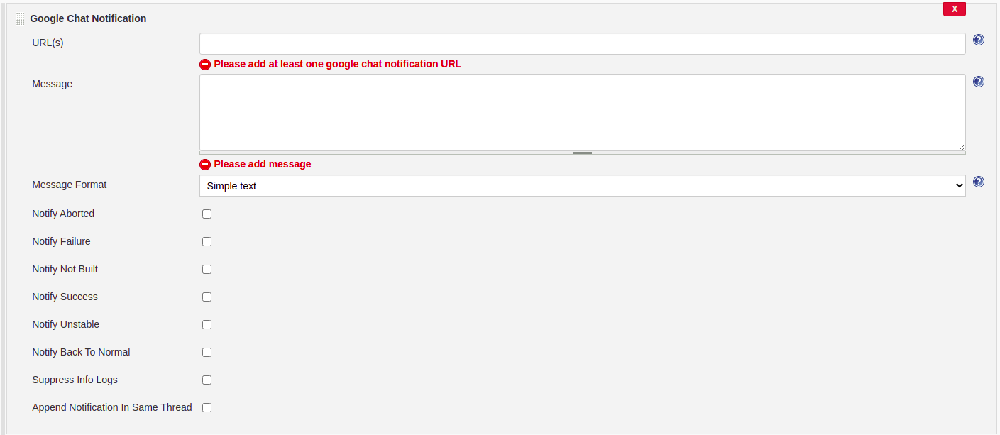

# google-chat-notification-jenkins-plugin

Google Chat Notification Jenkins Plugin to send build status to [Google Chat](https://chat.google.com)

This Jenkins plugin allows you to send Google Chat notification as a post build action or as a pipeline script.
This plugin is supported for Jenkins version **2.361.1 or higher**.

## Prerequisites

- You must create a web hook in google chat group to send notification.

## How to configure it in post build action

- Click on Add post-build action button

- Click on Google Chat Notification

- Configure URL (web hook URL configured in prerequisites), message (build message) and type of build result you want to send notification. You can configure multiple URLs separated by comma.

## How to use it in pipeline script

Use below command
### googlechatnotification url: 'web hook(s) URL(s)', message: 'message to be sent', messageFormat: 'simple|card', notifyAborted: 'true', notifyFailure: 'true', notifyNotBuilt: 'true', notifySuccess: 'true', notifyUnstable: 'true', notifyBackToNormal: 'true', suppressInfoLoggers: 'true', sameThreadNotification: 'true'

## Please find explanations for each fields as below, usage for all fields remains same for build job and pipeline:

1. **url**
   - This is a mandatory String parameter.
   - Single/multiple comma separated HTTP URLs or/and single/multiple comma separated Credential IDs.
     - To use Credential ID as URL identifier configure entire URL as secret in credential. Use *id:credential_id_for_room1* as value in URL.

     

   - Different Sample Ways to define URL parameter:
     - https://chat.googleapis.com/v1/spaces/room_id/messages?key=key_id&token=token_id 
     - https://chat.googleapis.com/v1/spaces/room_id/messages?key=key_id&token=token_id, https://chat.googleapis.com/v1/spaces/room_id2/messages?key=key_id2&token=token_id2 
     - id:credential_id_for_room1 
     - id:credential_id_for_room1, id:credential_id_for_room2 
     - https://chat.googleapis.com/v1/spaces/room_id/messages?key=key_id&token=token_id, id:credential_id_for_room2 

1. **message**
   - This is a mandatory String parameter.
   - Notification message to be sent.
   - Supports all token macro variables for pipeline as well as build jobs.

1. **messageFormat**
   - This is an optional String parameter.
   - The format of the message sent. Default value is `simple`.
   - If `card` is provided as value, the parameter `message` must be a [valid JSON configuration](https://developers.google.com/chat/reference/message-formats/cards) for card message.
   
1. **sameThreadNotification**
   - This is an optional boolean parameter. Default value is false.
   - This parameter is used to send notification in same thread for a particular job. If false, the default behavior is to create a new thread for each message.
   
1. **threadKey**
   - This is an optional String parameter. Default value is null.
   - The thread used to send all the generated notification messages for a particular job. If not defined, the default behavior is to use the JOB_NAME as thread_key.
   - This parameter only applies if *sameThreadNotification* is set to true.

1. **notifyAborted**
   - This is an optional boolean parameter. Default value is false.
   - Notification message to be sent when build status is ABORTED.

1. **notifyFailure**
   - This is an optional boolean parameter. Default value is false.
   - Notification message to be sent when build status is FAILURE.

1. **notifyNotBuilt**
   - This is an optional boolean parameter. Default value is false.
   - Notification message to be sent when build status is NOT_BUILT.

1. **notifySuccess**
   - This is an optional boolean parameter. Default value is false.
   - Notification message to be sent when build status is SUCCESS.

1. **notifyUnstable**
   - This is an optional boolean parameter. Default value is false.
   - Notification message to be sent when build status is UNSTABLE.

1. **notifyBackToNormal**
   - This is an optional boolean parameter. Default value is false.
   - Notification message to be sent when build status is SUCCESS and previous build status was not SUCCESS.

1. **suppressInfoLoggers**
   - This is an optional boolean parameter. Default value is false.
   - Suppress all info loggers in Jenkins build.

## Default behaviour of plugin is to send notifications for all build status unless overridden with true value for above defined build statuses.
